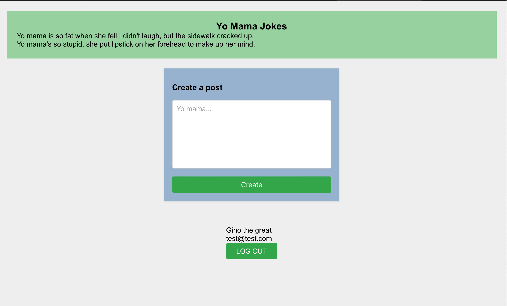

##Yo Mama Jokes App##

##Project Description
Welcome to the Yo Mama Jokes app. I wanted to create an app that was able to have users post their favorite yo mama joke and respond to others posts in the same fashion. Its similar to other messaging app just with a theme centered around a classic neighbor-'Hood' practice of 'roasting' somemone.

##Technologies Used
Some of the technologies used in this project are React, express, nodejs, mongoDB, mongoose,RESTful Api.

##Getting Started

[Link to Trello Board](https://trello.com/invite/b/whMXfEv2/ATTI0f12309cae110026f15e7e8a3873362aACF1DD3E/project3)

[Link to project deployed from Render](https://ginos-proj3.onrender.com)

Also, if you plan to clone this project you can install all dependencies by running: (npm i) in your terminal, without parenthesis.

##Unsolved Problems
There were unfortunately many of the standard CRUD functionality that was not accomplished. The only action I was able to accomplish was the Create. Additionaly I wanted to make every post have a user name and time created to distinguish between who post which joke but did implment that functionality. Finally I wanted to create a more appropriate color theme to compliment app.

##Future Enhancements
I wanted to add the ability to be able to comment on any of the jokes posted by any of the users. Also add the functionality to add voice messages.
